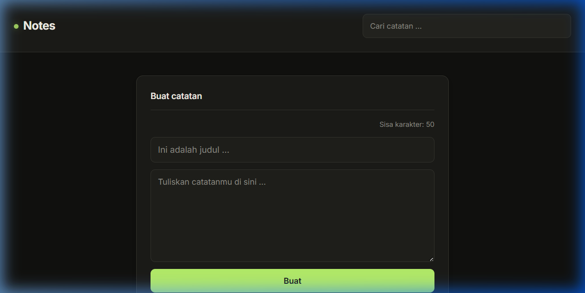
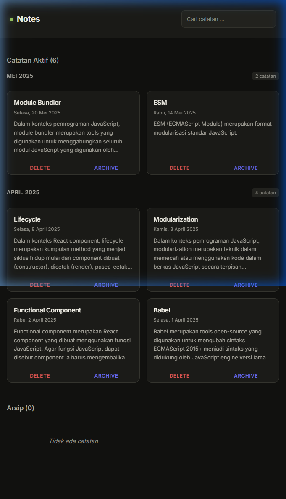

# My Personal Notes

Aplikasi catatan pribadi yang dibangun menggunakan React dan Vite sebagai submission kelas "Membuat Aplikasi Web dengan React" di Dicoding Academy. Aplikasi ini memungkinkan pengguna untuk membuat, mencari, mengarsipkan, dan menghapus catatan pribadi melalui antarmuka yang responsif dengan tema dark mode.


## Daftar Isi

- [Tentang Proyek](#tentang-proyek)
- [Teknologi yang Digunakan](#teknologi-yang-digunakan)
- [Struktur Proyek](#struktur-proyek)
- [Cara Menjalankan](#cara-menjalankan)
- [Fitur Aplikasi](#fitur-aplikasi)
- [Tampilan Aplikasi](#tampilan-aplikasi)
- [Penjelasan Kode per File](#penjelasan-kode-per-file)
  - [index.html](#indexhtml)
  - [vite.config.js](#viteconfigjs)
  - [src/index.jsx](#srcindexjsx)
  - [src/utils/index.js](#srcutilsindexjs)
  - [src/components/App.jsx](#srccomponentsappjsx)
  - [src/components/NoteInput.jsx](#srccomponentsnoteinputjsx)
  - [src/components/NoteSearch.jsx](#srccomponentsnotesearchjsx)
  - [src/components/NotesList.jsx](#srccomponentsnoteslistjsx)
  - [src/components/NoteItem.jsx](#srccomponentsnoteitemjsx)
  - [src/components/NoteActionButton.jsx](#srccomponentsnoteactionbuttonjsx)
  - [src/styles/style.css](#srcstylesstylecss)


## Tentang Proyek

My Personal Notes adalah aplikasi web berbasis React yang berfungsi sebagai pengelola catatan pribadi. Aplikasi ini dibangun menggunakan pendekatan class component dan functional component sesuai kebutuhan masing-masing komponen. Proyek ini mencakup empat kriteria penilaian utama, yaitu penguasaan array function, reusable component, state dan event management, serta controlled form.


## Teknologi yang Digunakan

| Teknologi | Versi | Keterangan |
|-----------|-------|------------|
| React | 19.1.1 | Library utama untuk membangun antarmuka pengguna |
| React DOM | 19.1.1 | Paket untuk rendering React ke DOM browser |
| Vite | 7.1.4 | Build tool dan development server |
| ESLint | 9.38.0 | Linter untuk menjaga kualitas kode JavaScript |
| eslint-config-dicodingacademy | 0.9.5 | Konfigurasi ESLint standar Dicoding |


## Struktur Proyek

```
my-personal-notes/
├── index.html                 # Halaman HTML utama (entry point Vite)
├── vite.config.js             # Konfigurasi Vite dengan plugin React
├── package.json               # Metadata proyek dan daftar dependensi
├── eslint.config.js           # Konfigurasi ESLint
├── public/                    # Aset statis
├── dist/                      # Hasil build production
└── src/
    ├── index.jsx              # Entry point React, merender App ke DOM
    ├── components/
    │   ├── App.jsx            # Komponen utama, mengelola seluruh state aplikasi
    │   ├── NoteInput.jsx      # Form untuk menambahkan catatan baru
    │   ├── NoteSearch.jsx     # Input pencarian catatan
    │   ├── NotesList.jsx      # Menampilkan daftar catatan dengan pengelompokan
    │   ├── NoteItem.jsx       # Kartu individual untuk setiap catatan
    │   └── NoteActionButton.jsx  # Tombol aksi reusable (hapus dan arsip)
    ├── styles/
    │   └── style.css          # Stylesheet utama dengan tema dark mode
    └── utils/
        └── index.js           # Data awal dan fungsi utilitas
```


## Cara Menjalankan

Pastikan Node.js sudah terinstal di komputer. Kemudian jalankan perintah berikut di dalam folder `my-personal-notes`:

```bash
# 1. Instal dependensi (hanya perlu dilakukan sekali)
npm install

# 2. Jalankan development server
npm run dev
```

Setelah berhasil, terminal akan menampilkan URL lokal seperti `http://localhost:5173/`. Buka URL tersebut di browser untuk melihat aplikasi.

Perintah lain yang tersedia:

| Perintah | Fungsi |
|----------|--------|
| `npm run dev` | Menjalankan development server dengan hot reload |
| `npm run build` | Membuat bundle production ke folder `dist` |
| `npm run serve` | Menjalankan preview dari hasil build production |


## Fitur Aplikasi

1. **Menambahkan catatan baru** melalui form input dengan judul dan isi catatan.
2. **Pencarian catatan** secara real-time berdasarkan judul catatan (case-insensitive).
3. **Menghapus catatan** dari daftar.
4. **Mengarsipkan dan mengembalikan catatan** antara daftar aktif dan arsip.
5. **Pengelompokan catatan** berdasarkan bulan dan tahun pembuatan.
6. **Batas karakter judul** maksimal 50 karakter dengan counter sisa karakter yang dinamis.
7. **Validasi form** yang menolak submit jika isi catatan kurang dari 10 karakter.
8. **Highlight pencarian** yang menyorot kata kunci di dalam judul dan isi catatan.
9. **Pesan kosong** yang ditampilkan ketika tidak ada catatan pada suatu daftar.


## Tampilan Aplikasi

Berikut adalah tampilan antarmuka aplikasi My Personal Notes saat dijalankan di browser.

### Halaman Utama - Form Input



Tampilan bagian atas aplikasi menampilkan header dengan judul "Notes" dan kolom pencarian di sisi kanan. Di bawahnya terdapat form "Buat catatan" yang terdiri dari input judul dengan counter sisa karakter (maksimal 50), textarea untuk isi catatan, dan tombol "Buat" berwarna hijau untuk menyimpan catatan baru.

### Daftar Catatan dan Arsip



Tampilan daftar catatan yang dikelompokkan berdasarkan bulan dan tahun. Grup "Mei 2025" menampilkan 2 catatan (Module Bundler dan ESM), sedangkan grup "April 2025" menampilkan 4 catatan (Lifecycle, Modularization, Functional Component, dan Babel). Setiap kartu catatan dilengkapi tombol "DELETE" berwarna merah dan "ARCHIVE" berwarna ungu. Di bagian bawah terdapat section "Arsip (0)" yang menampilkan pesan "Tidak ada catatan" karena belum ada catatan yang diarsipkan.


## Penjelasan Kode per File

---

### index.html

File HTML utama yang menjadi titik masuk aplikasi di sisi browser. Vite menggunakan file ini sebagai template saat menjalankan development server maupun saat proses build.

```html
<!DOCTYPE html>
<html lang="en">
<head>
    <meta charset="UTF-8" />
    <link rel="icon" type="image/svg+xml" href="/vite.svg" />
    <meta name="viewport" content="width=device-width, initial-scale=1.0" />
    <title>Vite + React</title>
</head>
<body>
<div id="root"></div>
<script type="module" src="/src/index.jsx"></script>
</body>
</html>
```

Penjelasan:
- Tag `<div id="root">` berfungsi sebagai wadah (container) tempat seluruh aplikasi React akan di-render. React tidak langsung memanipulasi `<body>`, melainkan menargetkan elemen spesifik ini.
- Tag `<script type="module" src="/src/index.jsx">` memuat entry point JavaScript menggunakan ES Module. Vite secara otomatis melakukan transformasi JSX dan hot module replacement saat development.

---

### vite.config.js

File konfigurasi Vite yang mendaftarkan plugin React agar Vite dapat memproses sintaks JSX.

```javascript
import { defineConfig } from 'vite'
import react from '@vitejs/plugin-react'

export default defineConfig({
  plugins: [react()],
})
```

Penjelasan:
- Fungsi `defineConfig` dari Vite digunakan untuk membuat objek konfigurasi dengan dukungan autocompletion.
- Plugin `@vitejs/plugin-react` mengaktifkan dukungan JSX transformation dan React Fast Refresh saat development, sehingga perubahan kode langsung terlihat di browser tanpa perlu reload manual.

---

### src/index.jsx

Entry point utama aplikasi React. File ini bertugas menghubungkan komponen React dengan DOM browser.

```javascript
import React from 'react';
import { createRoot } from 'react-dom/client';
import App from './components/App.jsx';
import './styles/style.css';

const root = createRoot(document.getElementById('root'));
root.render(<App />);
```

Penjelasan:
- `createRoot` adalah API React 18+ untuk membuat root rendering. Fungsi ini menerima elemen DOM (`#root` dari `index.html`) sebagai target rendering.
- `root.render(<App />)` merender komponen `App` ke dalam elemen root tersebut. Komponen `App` menjadi akar dari seluruh pohon komponen aplikasi.
- Import `style.css` memastikan stylesheet dimuat secara global untuk seluruh aplikasi.

---

### src/utils/index.js

File utilitas yang menyediakan data awal dan fungsi pembantu yang digunakan di berbagai komponen.

```javascript
const getInitialData = () => ([
  {
    id: 1,
    title: 'Babel',
    body: 'Babel merupakan tools open-source ...',
    createdAt: '2025-04-01T04:27:34.572Z',
    archived: false,
  },
  // ... 5 catatan lainnya
]);

const showFormattedDate = (date) => {
  const options = {
    weekday: 'long',
    year: 'numeric',
    month: 'long',
    day: 'numeric'
  };
  return new Date(date).toLocaleDateString('id-ID', options);
};

export { getInitialData, showFormattedDate };
```

Penjelasan:
- `getInitialData` mengembalikan array berisi 6 objek catatan awal. Setiap objek memiliki properti `id` (identitas unik), `title` (judul), `body` (isi), `createdAt` (tanggal pembuatan dalam format ISO 8601), dan `archived` (status arsip bertipe boolean).
- `showFormattedDate` menerima string tanggal ISO dan mengubahnya menjadi format tanggal yang mudah dibaca dalam bahasa Indonesia menggunakan `toLocaleDateString` dengan locale `id-ID`. Contoh hasil: "Selasa, 1 April 2025".
- Kedua fungsi diekspor menggunakan named export sehingga bisa diimpor secara selektif oleh komponen yang membutuhkan.

---

### src/components/App.jsx

Komponen utama yang bertindak sebagai pusat pengelolaan state dan logika bisnis seluruh aplikasi. Dibuat sebagai class component karena menggunakan state dan event handler.

```javascript
class App extends React.Component {
  constructor(props) {
    super(props);
    this.state = {
      notes: getInitialData(),
      searchKeyword: '',
    };
    // binding method ke konteks this
  }
  // ... method handler dan render
}
```

State yang dikelola:
- `notes` menyimpan array seluruh catatan, diinisialisasi dari `getInitialData()`.
- `searchKeyword` menyimpan kata kunci pencarian yang diketik pengguna.

Method handler:

| Method | Fungsi | Teknik Array |
|--------|--------|--------------|
| `onAddNoteHandler` | Menambahkan catatan baru ke state dengan spread operator. ID dihasilkan dari `+new Date()` dan properti `archived` di-set `false`. | Spread operator |
| `onDeleteHandler` | Menghapus catatan berdasarkan ID menggunakan `Array.prototype.filter` yang mengembalikan array baru tanpa catatan yang di-hapus. | `filter` |
| `onArchiveHandler` | Mengubah status `archived` catatan menggunakan `Array.prototype.map`. Jika ID cocok, nilai `archived` di-toggle dengan operator `!`. | `map` |
| `onSearchHandler` | Menyimpan kata kunci pencarian ke state `searchKeyword`. | - |

Logika pada method `render`:
1. Catatan difilter berdasarkan `searchKeyword` menggunakan `filter` dan `includes` secara case-insensitive (kedua string diubah ke lowercase).
2. Hasil filter dipisah menjadi dua kelompok: catatan aktif (`archived === false`) dan catatan arsip (`archived === true`).
3. Kedua kelompok diurutkan berdasarkan tanggal terbaru menggunakan `sort` dengan perbandingan objek `Date`.
4. Komponen merender header dengan `NoteSearch`, form `NoteInput`, serta dua section terpisah untuk catatan aktif dan arsip, masing-masing dengan judul yang menampilkan jumlah catatan.

---

### src/components/NoteInput.jsx

Komponen form untuk menambahkan catatan baru. Dibuat sebagai class component karena mengelola state input secara internal (controlled component).

```javascript
class NoteInput extends React.Component {
  constructor(props) {
    super(props);
    this.state = {
      title: '',
      body: '',
      errorMessage: '',
    };
  }
  // ... event handler dan render
}
```

State yang dikelola:
- `title` menyimpan nilai input judul catatan.
- `body` menyimpan nilai textarea isi catatan.
- `errorMessage` menyimpan pesan error validasi.

Alur kerja form:

1. Pengguna mengetik judul. Method `onTitleChangeEventHandler` memperbarui state `title` hanya jika panjang karakter tidak melebihi 50. Pembatasan ini dilakukan melalui logika state, bukan atribut HTML `maxLength`.

2. Counter sisa karakter dihitung dengan rumus `50 - this.state.title.length` dan ditampilkan di atas input judul. Ketika sisa karakter kurang dari 10, class CSS tambahan `note-input__title__char-limit--warn` ditambahkan untuk memberikan indikasi visual berupa perubahan warna.

3. Pengguna mengetik isi catatan. Method `onBodyChangeEventHandler` memperbarui state `body` dan menghapus pesan error jika ada.

4. Saat form di-submit, method `onSubmitEventHandler` melakukan validasi: jika panjang `body` kurang dari 10 karakter, pesan error ditampilkan dan proses submit dihentikan. Jika validasi lolos, `props.addNote` dipanggil dengan data `title` dan `body`, kemudian seluruh state form direset ke nilai kosong.

5. Pesan error ditampilkan menggunakan elemen `<p>` dengan class `note-input__feedback--error` yang diberi styling berupa background merah transparan dan border kiri berwarna merah.

---

### src/components/NoteSearch.jsx

Komponen pencarian catatan yang menerima input kata kunci dari pengguna. Dibuat sebagai class component dengan state internal.

```javascript
class NoteSearch extends React.Component {
  constructor(props) {
    super(props);
    this.state = { keyword: '' };
  }

  onKeywordChangeHandler(event) {
    const keyword = event.target.value;
    this.setState({ keyword });
    this.props.onSearch(keyword);
  }
  // ... render
}
```

Penjelasan:
- State `keyword` menyimpan nilai input pencarian sebagai controlled component.
- Setiap kali pengguna mengetik, method `onKeywordChangeHandler` dipanggil. Method ini memperbarui state lokal dan sekaligus memanggil `props.onSearch` untuk meneruskan kata kunci ke komponen `App`.
- Pencarian bersifat real-time karena callback dipanggil pada setiap perubahan input (`onChange`), bukan hanya saat submit.

---

### src/components/NotesList.jsx

Komponen functional yang bertanggung jawab merender daftar catatan dengan pengelompokan berdasarkan bulan dan tahun.

```javascript
function NotesList({ notes, onDelete, onArchive, dataTestId, searchKeyword }) {
  // validasi dan pengelompokan
}
```

Props yang diterima:
- `notes` adalah array catatan yang sudah difilter.
- `onDelete` dan `onArchive` adalah callback untuk aksi hapus dan arsip.
- `dataTestId` menentukan atribut `data-testid` untuk pengujian.
- `searchKeyword` diteruskan ke `NoteItem` untuk fitur highlight.

Alur logika:

1. Komponen memeriksa apakah array `notes` kosong. Jika kosong, menampilkan pesan "Tidak ada catatan" dengan class `notes-list__empty-message`.

2. Jika ada catatan, dilakukan pengelompokan menggunakan `Array.prototype.reduce`. Setiap catatan dikelompokkan berdasarkan kunci `NamaBulan-Tahun` (contoh: "April-2025"). Nama bulan menggunakan bahasa Indonesia.

3. Fungsi `formatGroupHeader` mengubah kunci grup menjadi format yang lebih mudah dibaca, misalnya "April-2025" menjadi "April 2025".

4. Setiap grup dirender sebagai `<section>` dengan class `notes-group`. Setiap section memiliki header yang menampilkan nama bulan-tahun dan jumlah catatan dalam grup tersebut. Di dalam section, setiap catatan dirender menggunakan komponen `NoteItem` melalui `Array.prototype.map`.

---

### src/components/NoteItem.jsx

Komponen functional yang merender kartu individual untuk setiap catatan. Komponen ini juga mendefinisikan fungsi `highlightText` untuk fitur penyorotan kata kunci pencarian.

```javascript
function highlightText(text, keyword) {
  if (!keyword || keyword.trim() === '') return text;
  const regex = new RegExp(`(${keyword.replace(/[.*+?^${}()|[\]\\]/g, '\\$&')})`, 'gi');
  const parts = text.split(regex);
  return parts.map((part, index) =>
    regex.test(part) ? <mark key={index}>{part}</mark> : part
  );
}
```

Fungsi `highlightText`:
- Menerima parameter `text` (teks yang akan diproses) dan `keyword` (kata kunci pencarian).
- Jika `keyword` kosong, mengembalikan teks asli tanpa perubahan.
- Karakter spesial regex di dalam keyword di-escape menggunakan `replace` agar tidak menyebabkan error saat membuat objek `RegExp`.
- Teks dipecah berdasarkan pola regex menjadi array menggunakan `split`. Bagian yang cocok dengan keyword dibungkus dalam elemen `<mark>`, sedangkan bagian lain dibiarkan sebagai teks biasa.
- Flag `gi` pada regex berarti pencarian bersifat global (semua kemunculan) dan case-insensitive.

Komponen `NoteItem`:
- Menampilkan judul catatan melalui `highlightText(note.title, searchKeyword)` di dalam tag `<h3>`.
- Menampilkan tanggal pembuatan menggunakan fungsi utilitas `showFormattedDate` di dalam tag `<p>`.
- Menampilkan isi catatan melalui `highlightText(note.body, searchKeyword)` di dalam tag `<p>`.
- Bagian aksi menyediakan dua tombol menggunakan komponen `NoteActionButton`: tombol "Delete" untuk menghapus dan tombol "Archive"/"Unarchive" yang labelnya berubah sesuai status `note.archived`.

---

### src/components/NoteActionButton.jsx

Komponen functional reusable untuk tombol aksi pada setiap kartu catatan. Komponen ini menghindari duplikasi kode tombol dengan menggunakan sistem variant.

```javascript
function NoteActionButton({ variant, onClick, children }) {
  const classNameMap = {
    delete: 'note-item__delete-button',
    archive: 'note-item__archive-button',
  };
  const testIdMap = {
    delete: 'note-item-delete-button',
    archive: 'note-item-archive-button',
  };
  return (
    <button className={classNameMap[variant]} type="button"
      onClick={onClick} data-testid={testIdMap[variant]}>
      {children}
    </button>
  );
}
```

Penjelasan:
- Props `variant` menentukan jenis tombol ("delete" atau "archive"), yang digunakan untuk memilih class CSS dan atribut `data-testid` yang sesuai dari objek mapping.
- Props `onClick` adalah callback yang dipanggil saat tombol diklik.
- Props `children` adalah teks label tombol yang dirender di antara tag pembuka dan penutup komponen.
- Pendekatan ini membuat komponen dapat digunakan ulang untuk berbagai jenis tombol aksi hanya dengan mengubah prop `variant`, tanpa perlu membuat komponen tombol terpisah untuk setiap aksi.

---

### src/styles/style.css

Stylesheet utama aplikasi yang menggunakan pendekatan CSS custom properties (CSS variables) untuk membangun sistem desain yang konsisten dengan tema dark mode.

Bagian-bagian utama stylesheet:

**Design Tokens**

CSS variables didefinisikan di dalam selector `:root` dan dikelompokkan menjadi beberapa kategori:
- Surfaces: warna latar belakang dengan tingkatan berbeda (`--canvas`, `--surface`, `--surface-hover`, `--surface-raised`).
- Text: tiga tingkatan warna teks (`--text-primary`, `--text-secondary`, `--text-muted`).
- Brand: warna aksen utama hijau (`--signal: #b9f26b`) dan ungu (`--data-accent: #6467f2`).
- Semantic: warna untuk status seperti success, warning, danger, dan info.
- Spacing: sistem jarak berbasis kelipatan 4px.
- Radius, shadow, dan transition: nilai-nilai yang digunakan secara konsisten di seluruh komponen.

**Komponen Styling**

| Selector | Fungsi |
|----------|--------|
| `.note-app__header` | Header sticky dengan backdrop blur dan dot hijau animasi di samping judul |
| `.note-input` | Card form input dengan efek shadow saat hover |
| `.note-input__feedback--error` | Pesan error dengan background merah transparan dan border kiri |
| `.note-input__title__char-limit` | Counter karakter dengan perubahan warna warning |
| `.notes-list` | Grid layout responsif untuk daftar catatan |
| `.notes-group` | Container grup catatan per bulan-tahun dengan header dan counter |
| `.note-item` | Card catatan dengan animasi hover translateY dan fade-in |
| `.note-item__delete-button` | Tombol hapus berwarna merah dengan hover background |
| `.note-item__archive-button` | Tombol arsip berwarna ungu dengan hover background |
| `.note-item mark` | Styling untuk highlight pencarian dengan background hijau transparan |
| `.note-search` | Input pencarian di header |

**Responsive Design**

Stylesheet menggunakan tiga breakpoint media query:
- Mulai dari 500px: grid catatan berubah menjadi 2 kolom.
- Mulai dari 800px: grid catatan berubah menjadi 3 kolom dan input pencarian diperlebar.
- Mulai dari 1000px: grid catatan berubah menjadi 4 kolom.

**Animasi**

- `pulse-dot`: animasi berkedip pada dot hijau di samping judul header.
- `fade-in-up`: animasi kemunculan kartu catatan dan grup catatan dari bawah ke atas dengan efek opacity.


## Alur Data Antar Komponen

```
App (state: notes, searchKeyword)
├── NoteSearch
│   └── Mengirim keyword ke App via props.onSearch
├── NoteInput
│   └── Mengirim data catatan baru ke App via props.addNote
├── NotesList (catatan aktif)
│   └── NoteItem
│       └── NoteActionButton (delete, archive)
│           └── Memanggil App.onDeleteHandler / App.onArchiveHandler
└── NotesList (catatan arsip)
    └── NoteItem
        └── NoteActionButton (delete, unarchive)
            └── Memanggil App.onDeleteHandler / App.onArchiveHandler
```

Seluruh state dikelola secara terpusat di komponen `App`. Komponen anak menerima data dan callback melalui props, kemudian memanggil callback tersebut untuk memicu perubahan state di `App`. Pola ini dikenal sebagai "lifting state up" dalam terminologi React, di mana state diangkat ke komponen induk terdekat yang membutuhkannya.
